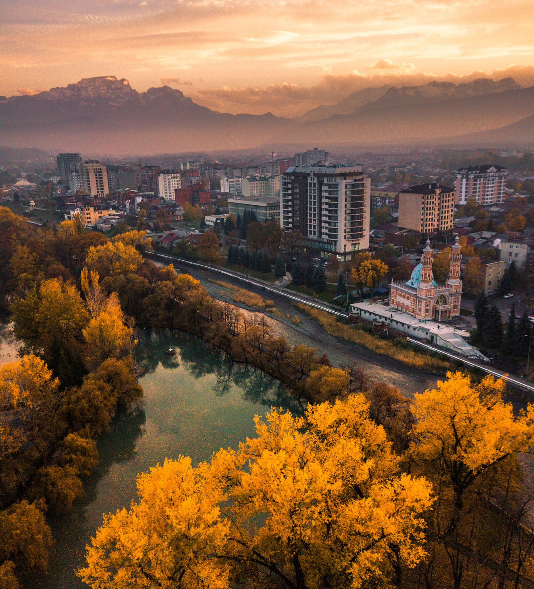

# Заголовок 1
## Заголовок 2
### Заголовок 3
#### Заголовок 4
##### Заголовок 5
###### Заголовок 6
----
Заголовок 1
=
1. Пукт списка общего
    * пункт списка
    * пункт списка
    * ***пункт списка***
    * _пункт списка_
    * пункт списка
    * пункт списка
----
```
Сегодня прекрасный день, чтобы позаниматься и отдохнуть.
```

>цитата красота  
оченть

[текст](http://google.com)


---

[](http://google.com)
---

Item     | Value | Quantity
:------- |:-----:| -------:
Computer | 1600  | 3
Computer | 1600  | 3
Computer | 1600  | 3